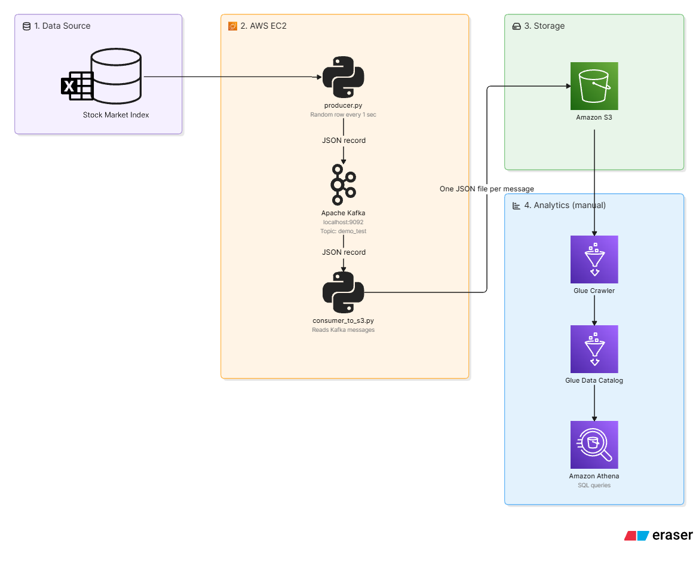

# 📈 Real-Time Stock Market Data Pipeline using Apache Kafka & AWS

## Overview

This project demonstrates a real-time data engineering pipeline built using Apache Kafka and AWS. Stock market data is streamed through Kafka, stored in Amazon S3, and made available for analytics using AWS Glue and Amazon Athena.

The project focuses on building a scalable and cloud-native streaming architecture while showcasing key Data Engineering concepts such as real-time ingestion, data lake storage, metadata management, and serverless querying.

## Architecture

## Tech Stack

### Languages
- Python

### Streaming Platform
- Apache Kafka

### AWS Services
- Amazon EC2
- Amazon S3
- AWS Glue Crawler
- AWS Glue Data Catalog
- Amazon Athena

## Pipeline Workflow

1. Generate stock market data using Python.
2. Publish records to Kafka topics using a Producer.
3. Consume streaming data using a Kafka Consumer.
4. Store processed records in Amazon S3.
5. Crawl S3 data using AWS Glue Crawler.
6. Create metadata tables in AWS Glue Data Catalog.
7. Query data directly from S3 using Amazon Athena.

## Dataset

The project uses a sample stock market dataset for simulating real-time data streaming.

Dataset Link:
- https://github.com/Aditya0241/kafka-streaming-project/blob/main/indexProcessed.csv

## Key Features

- Real-time data ingestion using Apache Kafka
- Event-driven streaming architecture
- Data Lake implementation using Amazon S3
- Automated schema discovery with AWS Glue
- Serverless analytics using Amazon Athena
- Scalable cloud-based data pipeline

## Skills Demonstrated

- Data Engineering
- Apache Kafka
- AWS Cloud
- Data Lakes
- ETL Pipelines
- Python
- SQL
- Real-Time Data Processing
- Metadata Management

## Future Improvements

- Integrate live stock market APIs
- Add Apache Spark Structured Streaming
- Build QuickSight dashboards
- Implement Infrastructure as Code (Terraform)
- Automate deployment using CI/CD pipelines
